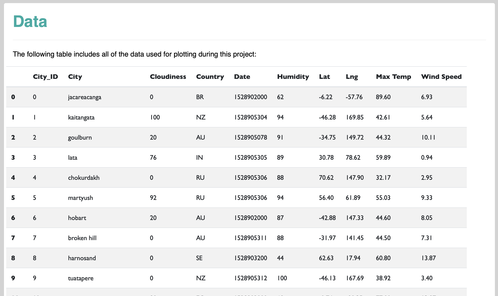

# Weather Data Visualization

## Overview:
Assignment in which a visualization dashboard website was created for weather data using HTML, CSS, Bootstrap and Pandas tools.

## Data:
The data were pulled from the OpenWeatherMap API to assemble a dataset of 546 cities. The dataset contains each city's ID, name, latitude and longitude. It also contains humidity, maximum temperature, wind speed and date of the measurements.

## Workflow:

The dashboard was created with HTML and CSS was used for styling. Bootstrap was used for responsiveness to resizing and Pandas was used to deploy the dataset into the HTML data page.

The website is composed of seven individual pages, each containing a graph that compares latitude to the other city characteristics in the dataset. The dashboard contains a navigation bar and a drop-down menu to navigate through the website. 

