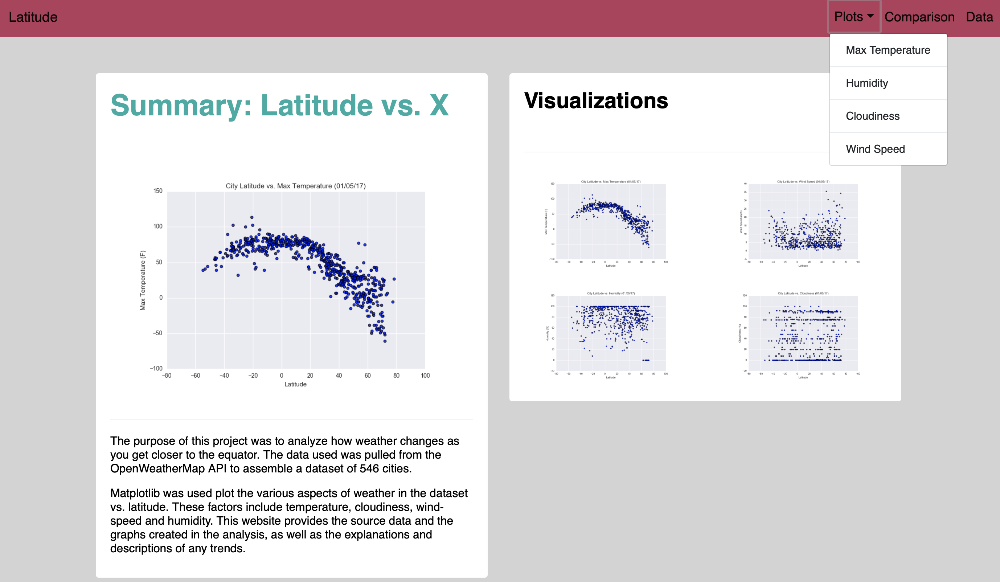

# Web Design Challenge

## Overview:
Assignment in which a visualization dashboard website was created for weather data using HTML, CSS, Bootstrap and Pandas tools.

## Data:
Dataset containing city ID, city name, date, latitude, longitude, humidity, maximum temperature and wind speed for 546 cities.

## Workflow:

Using HTML, CSS and Bootstrap. 

The website contains a main landing page 

